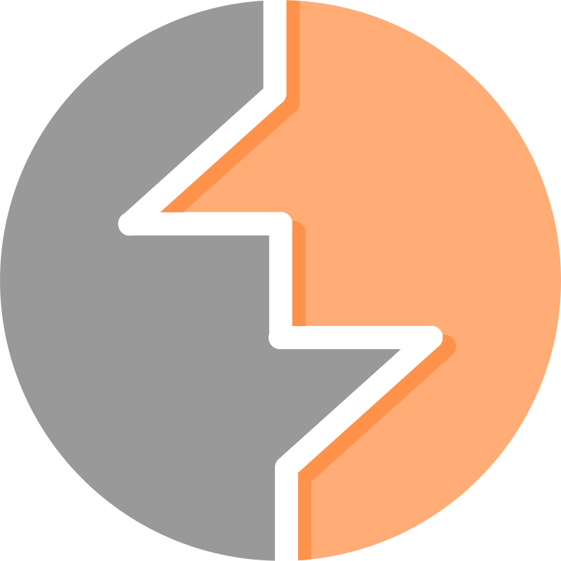
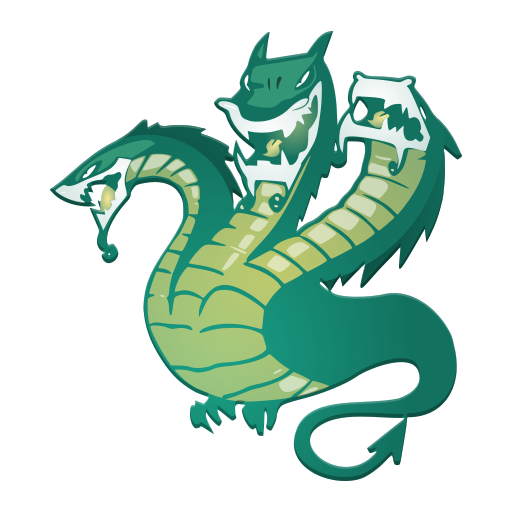

###

<h1 align="center">
    
</h1>
<h2 align="left">Passionate about cybersecurity and CTFs. I strive to be like a sponge, absorbing all the knowledge I can.</h2>

###

###

- 📝 Posting writeups and notes [**here**](https://whare1.github.io)
- 🔭 I’m currently preparing for the **OSCP**

###

<h3 align="left">My favorite lenguagues and tools:</h3>

###

  
  
  
  
  
  
  
  

###
<h3 align="left">Some of my Links:</h4>

###

  
  
  
  

###

  
  

###

<picture>
  <source media="(prefers-color-scheme: dark)" srcset="https://raw.githubusercontent.com/whare1/whare1/output/github-snake-dark.svg" />
  <source media="(prefers-color-scheme: light)" srcset="https://raw.githubusercontent.com/whare1/whare1/output/github-snake.svg" />
  
</picture>

###
